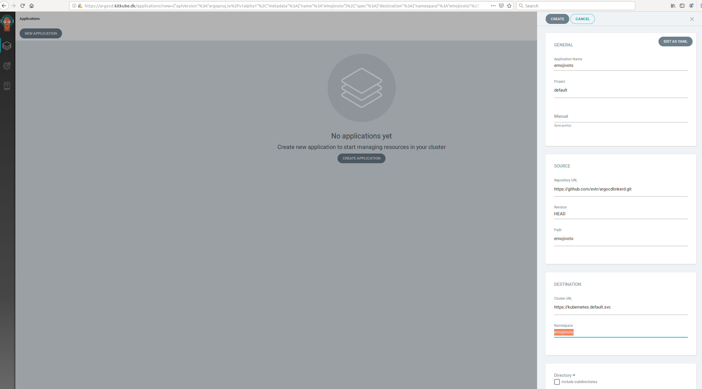

# Om

Dette projekt viser, hvordan argocd kan bruges som "deployment agent" på et Kitkube miljø. 
Det viser også, hvordan linkerd kan anvendes som service mesh.
Dette projekt er kun tiltænkt udviklinsmiljøet.

## Prerequisites
Du skal bruge:
 * Et kitkube Kubernetes cluster. Du kan med fordel følge opsætningen her: https://github.com/KvalitetsIT/ff-parent-infrastructure/tree/master/kubespray

## Installation af Argo CD
For at komme igang skal argocd installeres. Der er endnu ikke ansible scripts til dette, så du skal stå et sted, hvor du kan bruge kubectl.

1. Installér Argocd: I https://argoproj.github.io/argo-cd/getting_started/ skal du udføre trin 1 i vedledningen dvs. "Install Argo CD". I dette punkt oprettes et namespace og argocd installeres.
2. Opret ingress regel: *kubectl apply -n argocd -f https://raw.githubusercontent.com/evtr/argocdlinkerd/master/argocdbootstrap/argocd-ingress.yml*

Argo CD er derefter tilgængelig her: https://argocd.kitkube.dk/

Brugernavn er "admin" og password er pod navnet for Argo CD API serveren (kan også hentes ud med: *kubectl get pods -n argocd -l app.kubernetes.io/name=argocd-server -o name | cut -d'/' -f 2*).

## Installation af Linkerd
1. Installér Linkerd: Følg https://linkerd.io/2/getting-started/ trin 0-3.
2. Opret ingress regel: *kubectl apply -n linkerd -f https://raw.githubusercontent.com/evtr/argocdlinkerd/master/linkerdbootstrap/linkerd-web-ingress.yml*

Linkerd dashboard er tilgængeligt her: http://dashboard.kitkube.dk/overview (credentials: admin/admin)

## Installation af testapplikation
Du kan nu installere en testapplikation på clusteret ved at sætte den op i Argo CD:

Du kan tilgå applikationen: http://emojivoto.kitkube.dk/

Hvis du kigger i linkerd dashboard, så ses det, at "emojivoto" applikationen ikke er meshed.

Dette kan fixes, ved at sætte annotationen *linkerd.io/inject: enabled* på f.eks. namespacet emojivoto.

Der er lavet en release "vlinkerd-test-1" som kan deployes: Slet først applikationen i argocd (med cascade).
Installer nu applikationen igen (men sæt vlinkerd-test-1 ind i stedet for HEAD).

Nu kan man både se at antallet af containere i emojivoto pods er stedet fra 1 til 2 (injection af sidecar).
Derudover kan man se en masse interessante ting i linkerd dashboardet.

